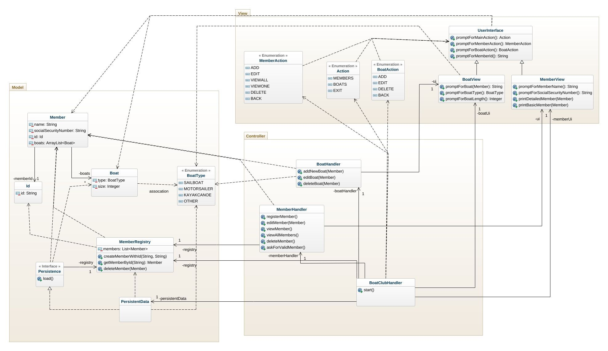
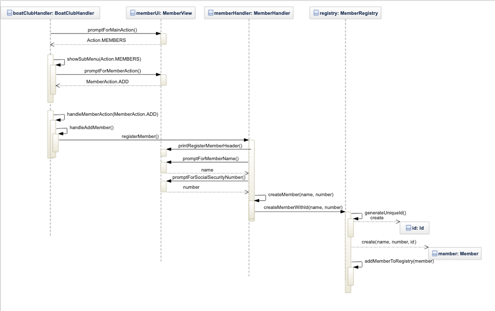

# Boatclub OO-Design
This document describes the design according to the requirements presented in assignment 2.

## Architectural Overview
The application uses the model-view-controller (MVC) architectural pattern. The view is passive and gets called from the controller. The view may only read information from the model, not directly change it.

## Detailed Design
### Class Diagram

*Note that enumeration relationships are always illustrated with a dependency arrow because of limitations in GenMyModel. In our design, there are both dependencies and associations. When the relationship is an association, a comment has been added.*

### Sequence Diagram

*Illustrates the scenario when a new member is added.*